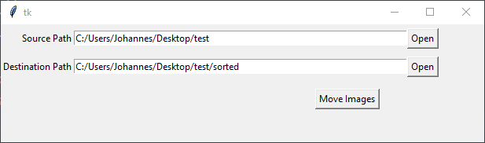

# image-sorter
Define Source and destination path and click 'Move Images'. Please note that this software is highly unstable and still under heavy development.
The result looks somewhat like this:
```
.
├── 2013
│   └── 03_März
│       ├── Image_001.jpg
│       ├── Image_394.png
│       └── Image_423.jpg
├── 2015 
│   └── 12_Dezember
│       └── Image_002.jpg 
└── 2020
    ├── 04_April
    │   ├── Image_001.jpg
    │   ├── Image_394.jpg
    │   ├── Image_423.png
    │   ├── Image_001.jpg
    │   ├── Image_394.jpg
    │   └── Image_423.png
    └── 09_September
        ├── Image_001.png
        ├── Image_394.jpg
        └── Image_423.png
```

<br>

# Screenshots
